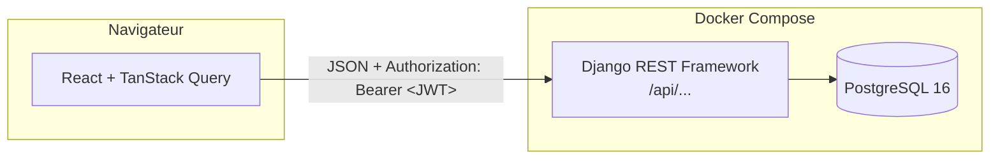

# LabTrack

[](https://github.com/AGNE-Moussa/labtrack/actions/workflows/ci.yml)
[](LICENSE)

Application web de gestion d'études de recherche : chaque chercheur crée ses projets, les suit par statut, les recherche et les filtre. Ses données restent strictement isolées de celles des autres utilisateurs.

C'est un projet d'apprentissage full-stack **Django REST Framework + React**. Je l'ai entièrement développé avec **[Claude Code](https://claude.com/claude-code)** comme binôme de programmation (voir [Construit avec Claude Code](#construit-avec-claude-code)).

## Fonctionnalités

- **Comptes utilisateurs** : inscription avec validation du mot de passe, connexion par JWT, renouvellement automatique du token, déconnexion.
- **Projets** : création, modification et suppression dans des fenêtres modales, page détail pour chaque projet.
- **Isolation des données** : chaque utilisateur ne voit que ses projets. Les projets d'un autre renvoient 404, sans révéler leur existence.
- **Recherche et filtres** : recherche plein texte (titre et description), filtre par statut, tri, pagination. Les filtres sont gardés dans l'URL : un lien se partage et F5 les conserve.
- **Tableau de bord** : compteurs par statut. Un clic sur un compteur filtre la liste.
- **Interface** : Tailwind CSS et shadcn/ui, états de chargement et états vides soignés, notifications, affichage mobile.

## Stack technique

| Couche | Technologies |
|---|---|
| Backend | Python 3.12, Django 6, Django REST Framework, SimpleJWT, django-filter |
| Base de données | PostgreSQL 16 |
| Frontend | React 19, TypeScript, Vite, TanStack Query, React Router, Tailwind CSS 4, shadcn/ui |
| Outillage | Docker Compose, GitHub Actions, oxlint |

## Architecture



Principaux points d'entrée de l'API :

| Méthode | URL | Rôle |
|---|---|---|
| `POST` | `/api/register/` | Création de compte (limitée à 10 par heure et par IP) |
| `POST` | `/api/token/` · `/api/token/refresh/` | Obtention et renouvellement du JWT |
| `GET` | `/api/me/` | Utilisateur connecté |
| `GET` `POST` | `/api/projects/?search=&status=&ordering=&page=` | Liste paginée et création |
| `GET` `PATCH` `PUT` `DELETE` | `/api/projects/{id}/` | Détail, modification, suppression |
| `GET` | `/api/projects/stats/` | Nombre de projets par statut |

## Lancer le projet

Prérequis : [Docker Desktop](https://www.docker.com/products/docker-desktop/).

```bash
git clone https://github.com/AGNE-Moussa/labtrack.git
cd labtrack
cp .env.example .env          # puis remplacer les valeurs « a-changer »
docker compose up -d --build
docker compose exec backend python manage.py migrate
docker compose exec backend python manage.py seed_demo
```

- Application : http://localhost:5173. Compte de démonstration : `demo` / `labtrack-demo`.
- API : http://localhost:8000/api/
- Administration Django : http://localhost:8000/admin/ (créer un compte avec `createsuperuser`).

## Tests et qualité

```bash
docker compose exec backend python manage.py test     # 44 tests backend
docker compose exec frontend npm run lint             # oxlint
docker compose exec frontend npm run build            # vérification TypeScript + build
```

La CI GitHub Actions ([`.github/workflows/ci.yml`](.github/workflows/ci.yml)) lance les mêmes vérifications à chaque push, plus un contrôle des migrations manquantes. Les tests backend couvrent notamment :

- l'isolation entre utilisateurs, y compris dans la recherche et les statistiques ;
- l'authentification JWT : token valide, invalide ou expiré ;
- la validation des mots de passe et la limitation des inscriptions ;
- la stabilité de la pagination quand plusieurs projets ont la même valeur de tri.

## Construit avec Claude Code

J'ai mené ce projet pour apprendre à travailler efficacement avec un agent de développement IA. J'y ai mis en pratique :

- **Un fichier [`CLAUDE.md`](CLAUDE.md)** : les conventions du projet que l'agent suit à chaque session (commandes Docker, Conventional Commits en français, une branche par tâche, interdiction de lire `.env`).
- **Des permissions explicites** ([`.claude/settings.json`](.claude/settings.json)) : les commandes sans risque sont autorisées, `git push` demande une confirmation, et la lecture de `.env` comme le `push --force` sont interdits.
- **Des sous-agents spécialisés** ([`.claude/agents/`](.claude/agents/)) :
  - `backend-reviewer` relit le code Django en lecture seule. Il a par exemple détecté un tri non déterministe qui pouvait faire apparaître un projet sur deux pages de la pagination.
  - `test-writer` écrit les tests manquants sans jamais toucher au code applicatif.
- **Le mode plan** : chaque fonctionnalité importante a commencé par un plan relu et validé avant la moindre ligne de code.
- **Un historique Git lisible** : une branche par fonctionnalité, fusionnée avec `--no-ff`, et des commits atomiques en Conventional Commits.

L'agent écrivait le code. Je gardais les décisions : la stratégie de migration, le stockage des tokens, le choix des bibliothèques, la validation de chaque étape dans le navigateur.

## Feuille de route

- [ ] Démo en ligne
- [ ] Tests frontend (Vitest + Testing Library)
- [ ] Expériences, sessions et participants rattachés à un projet
- [ ] Tokens dans des cookies httpOnly
- [ ] Thème sombre

## Licence

[MIT](LICENSE) © 2026 Moussa Agne
